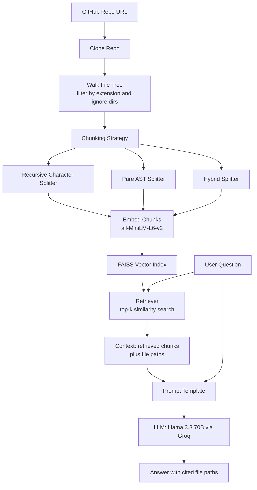

# GitHub Repo AI Assistant (RAG)

A Retrieval-Augmented Generation (RAG) assistant that lets you **ask questions about any GitHub codebase in natural language** and get answers grounded in the actual source files — with file paths cited for every answer.

Instead of manually grepping through a repo to find where something is implemented, clone it and just ask.

## Architecture



## How It Works

1. **Clone & Load** — Clones a target GitHub repository and walks its file tree, loading supported source files (`.py`, `.js`, `.ts`, `.jsx`, `.tsx`, `.java`, `.cpp`, `.c`, `.h`, `.hpp`, `.go`, `.rs`, `.md`), skipping irrelevant directories like `.git`, `node_modules`, `venv`, and build artifacts.

2. **Chunk** — Splits files into embeddable chunks. Three strategies are implemented and compared:
   - **Recursive character splitting** — generic, language-agnostic chunking by character count.
   - **Pure AST splitting** — parses Python files with `ast` and chunks by class/function boundaries, so logic is never cut mid-block.
   - **Hybrid splitting** — chunks by AST structure first, then falls back to recursive character splitting only when a class/function is too large for a single chunk. This gives the best balance of semantic coherence and embedding-size limits.

   ```mermaid
   flowchart TD
       A[Python file] --> B[Parse with ast module]
       B --> C{Class or function node?}
       C -->|Yes| D[Extract source lines<br/>for that node]
       C -->|No| E[Skip node]
       D --> F{Chunk length under 1000 chars?}
       F -->|Yes| G[Keep as single chunk]
       F -->|No| H[Split further with<br/>recursive character splitter]
       G --> I[Add to chunk list<br/>with type, name, line metadata]
       H --> I
   ```

3. **Embed & Index** — Each chunk is embedded using `sentence-transformers/all-MiniLM-L6-v2` and stored in a **FAISS** vector index for fast similarity search.

4. **Retrieve & Answer** — On a query, the top-k most relevant chunks are retrieved and passed as context to an LLM (**Llama 3.3 70B via Groq**) using a prompt that constrains answers strictly to the retrieved context, and instructs the model to say so explicitly if the answer isn't found in the repo. The assistant always cites the file path(s) behind its answer.

## Tech Stack

- **LangChain** (`langchain`, `langchain-community`, `langchain-huggingface`, `langchain-groq`, `langchain-text-splitters`)
- **FAISS** (`faiss-cpu`) for vector storage and similarity search
- **Sentence-Transformers** (`all-MiniLM-L6-v2`) for embeddings
- **Groq** (`llama-3.3-70b-versatile`) as the LLM backend
- **GitPython** for repo cloning
- Python's built-in `ast` module for structure-aware code chunking

## Setup

1. Install dependencies:
   ```bash
   pip install -U langchain langchain-community langchain-huggingface langchain-groq langchain-text-splitters faiss-cpu sentence-transformers gitpython
   ```

2. Set your Groq API key as an environment variable:
   ```bash
   export GROQ_API_KEY="your-api-key"
   ```
   (In the Colab notebook, this is read via `google.colab.userdata`.)

3. Clone the target repository you want to query, e.g.:
   ```bash
   git clone https://github.com/<owner>/<repo>.git
   ```

## Usage

Open and run `Github_repo_AI_assistant.ipynb` in Google Colab or Jupyter. The notebook will:

1. Load and embed the target repo's files.
2. Build (or reload) a FAISS index (`repo_index/`).
3. Let you ask questions like:
   ```
   "Where is ChatGroq implemented?"
   ```
   and return an answer with the exact file path(s) it came from.

The assistant also gracefully handles questions unrelated to the repo, answering them from general knowledge instead of forcing an irrelevant retrieval.

## Current Scope & Limitations

- AST-based structural chunking is currently implemented for **Python only**; other supported languages fall back to recursive character splitting.
- Runs as a Colab/Jupyter notebook rather than a packaged CLI or service.

## Roadmap

- Extend AST-aware chunking to other languages (JS/TS, Java, Go, Rust).
- Package the assistant as a reusable CLI/library for exploring arbitrary codebases.
- Add persistent/incremental indexing so large repos don't need to be re-embedded from scratch.

## License

Add a license of your choice (e.g., MIT) if you plan to share or accept contributions to this project.
